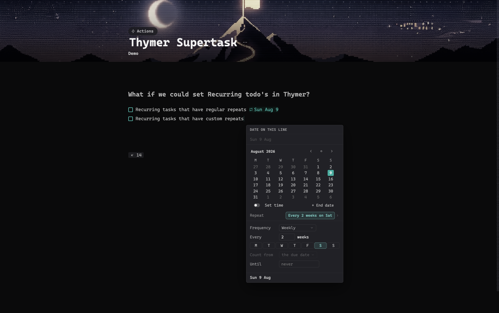
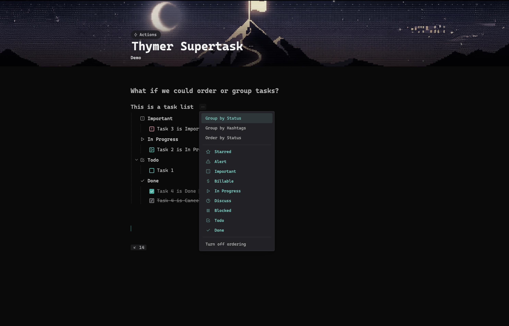
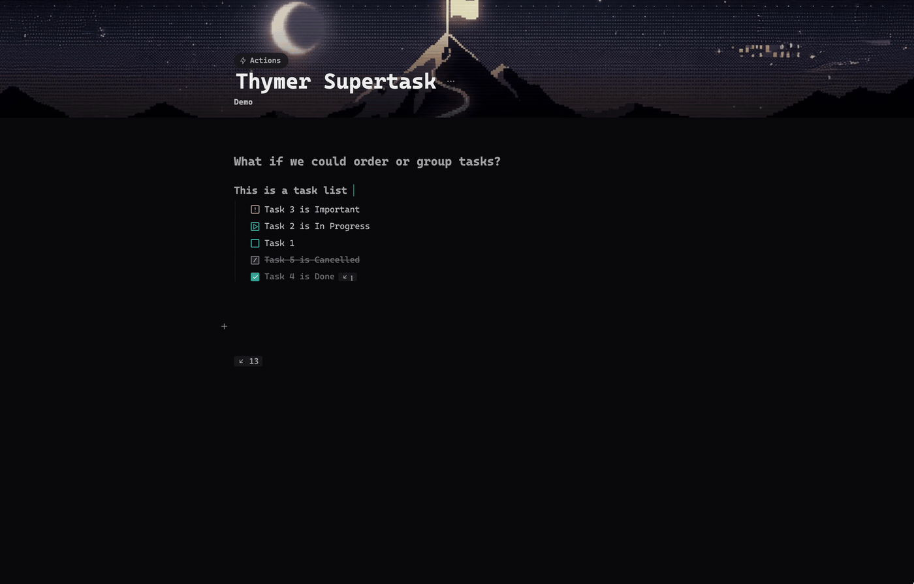
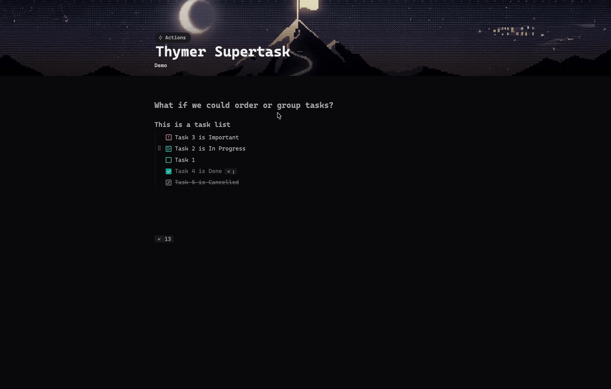
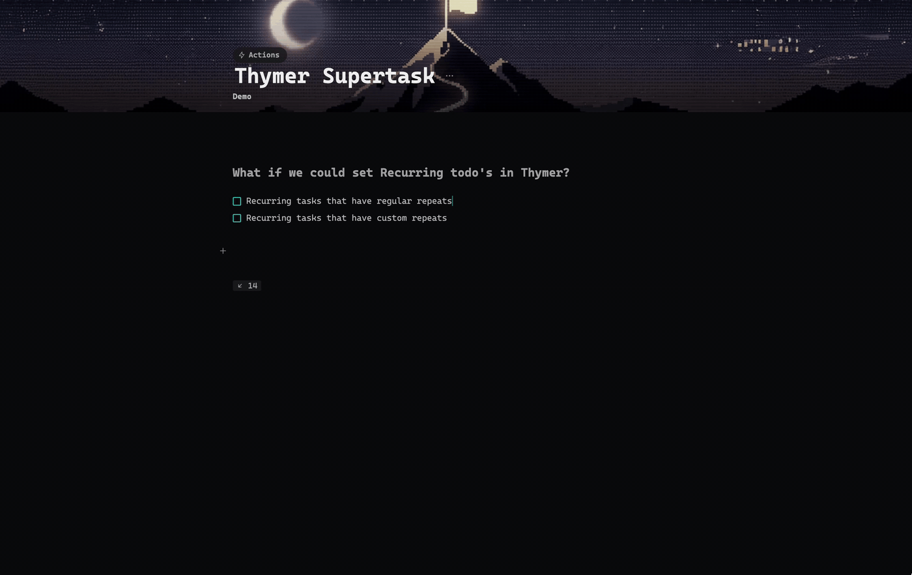
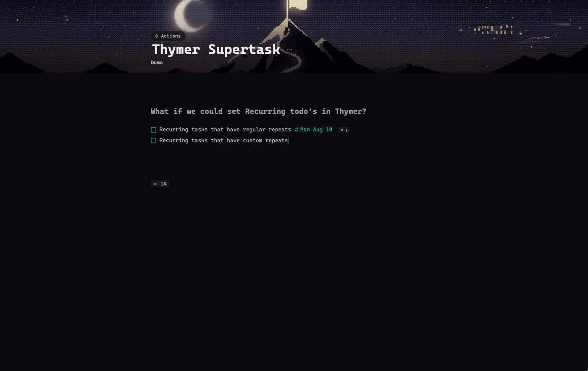
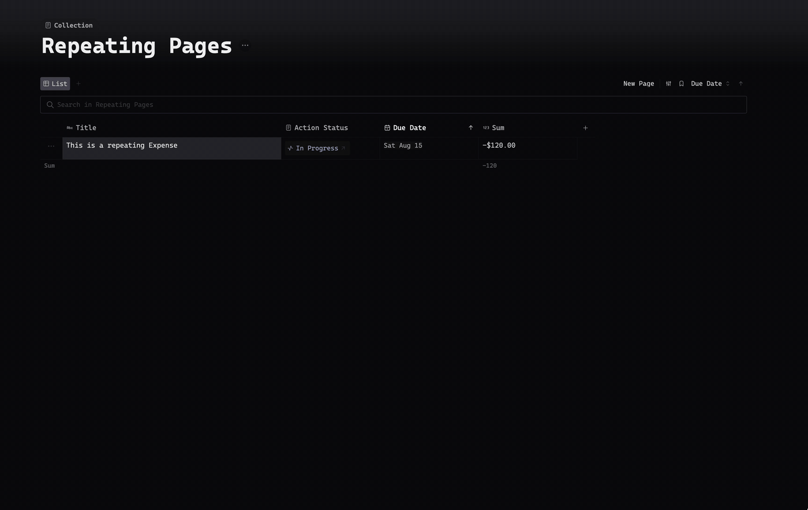
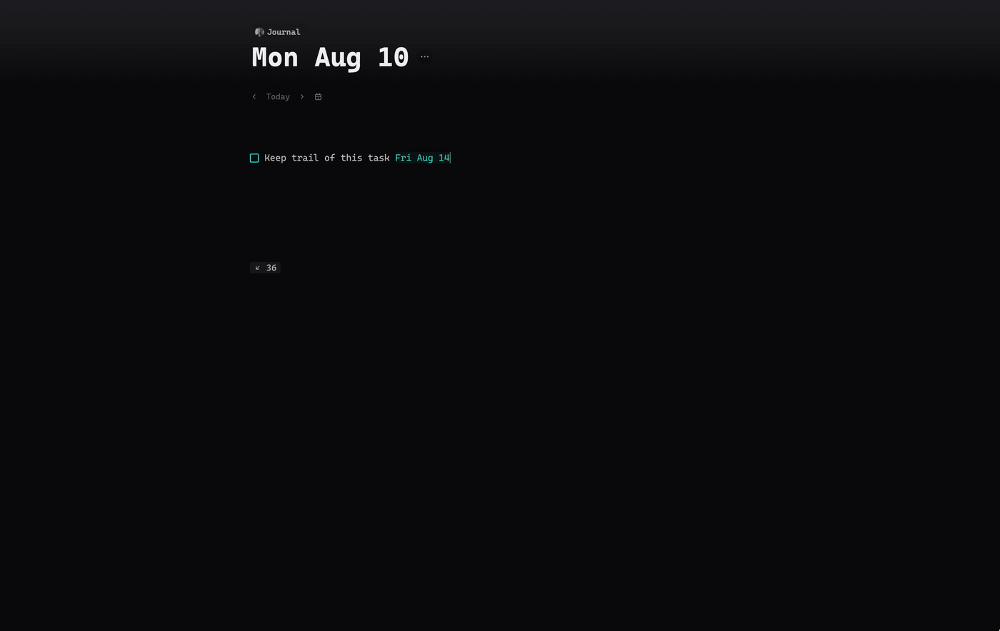
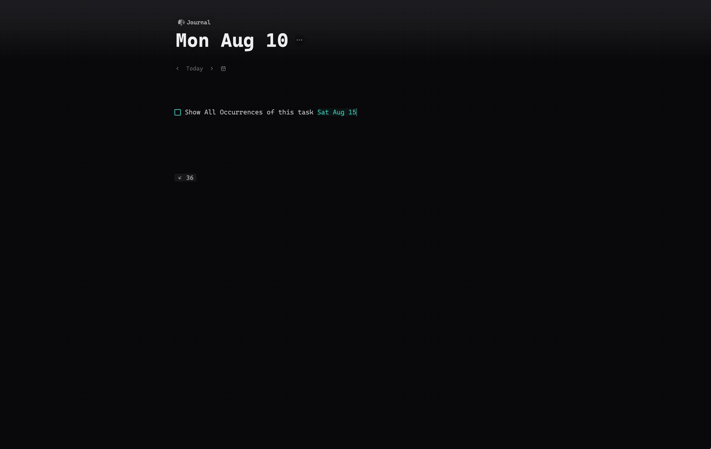
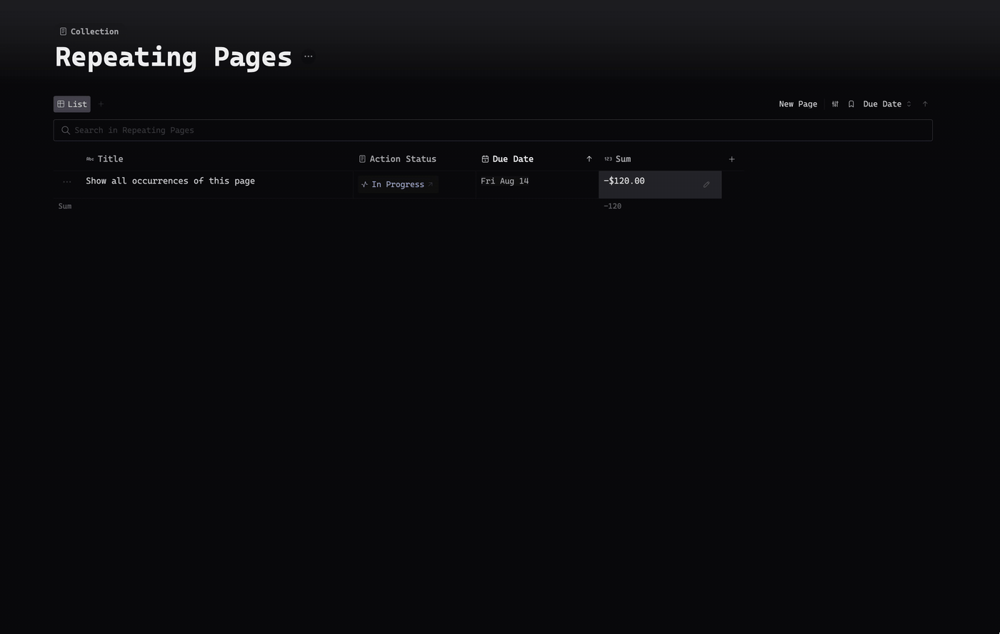

# Supertask

Supercharged tasks for [Thymer](https://thymer.com): date management and repeating tasks, self-organizing sections where you can Order by Status or Group by Status or Hashtags, and more. All without leaving the keyboard.



## Shortcuts

| Mac | Windows / Linux | What it does |
|---|---|---|
| `⌘1` … `⌘9` | `Ctrl+1` … `Ctrl+9` | Tag the caret's line with your own hashtags (timeblocks, priorities, contexts — yours to define in Settings). Same key again clears. |
| `⌃1` … `⌃9` | `Alt+1` … `Alt+9` | Set the task status: In Progress, Important, Alert, Starred, Billable, Discuss, Blocked, Clear, Done. Same chord again clears. |
| `⌃+` / `⌃−` | `Alt++` / `Alt+-` | Move the date one day forward / back |
| `⌘⇧S` | `Ctrl+Shift+S` | Open the date box: calendar, free-text parsing, time toggle, end dates, Repeat rule |

Keys are matched by physical position, so any keyboard layout works, and the Settings panel shows the chords for your platform. Thymer binds no digit key on any modifier, so the blocks are free in-app. Two OS-level caveats: macOS can claim `⌃`-digits for *Switch to Desktop* when you use multiple Spaces (System Settings → Keyboard → Shortcuts → Mission Control), and some Linux desktops bind `Alt`-digits to window or workspace switching — free the chord in your desktop's keyboard settings if one does nothing.

## Group and order your sections

Every heading can organize its own tasks — open the `⋯` menu that appears next to an ordered heading, or use the command palette:



- **Group by Status** — flagged tasks collect under status roofs (Starred, Alert, Important, Billable, In Progress, Discuss, Blocked), with **Done** last, starting collapsed, done on top and canceled at the bottom. Untriaged tasks can gather under a **Todo** roof just above Done.
- **Group by Hashtags** — roofs named after your `⌘`-digit hashtags, in `⌘`-digit order. Only the hashtags you configured count. Done always wins: a finished task files under Done, never lingers in the day plan.

- **Order by Status** — no roofs (except an optional Done group): a flat list sorted by status rank, untriaged at the bottom of the actives.



The roofs are real H5 headings, so they fold natively. A roof only exists while it has tasks — empty ones disappear by themselves. Tasks arriving from anywhere — moved in from another page, captured, typed, retagged, restatused — file themselves under the right roof within a couple of seconds. Turn everything off with one click and the section returns to a flat list.

Grouping can also be enabled **globally** in Settings: pick the statuses, and every heading in the workspace groups them as tasks change, no per-section setup. A section's own `⋯` menu always overrides the global choice.



## Which date moves

One set of chords covers both halves of a GTD system. The target resolves in this order:

1. A focused row in a collection view → that page's **Due Date** property
2. A **page** returned by a live search → that page's **Due Date** property
3. The caret's line carries a date → that date
4. The caret's line **is** a page reference (one ref and nothing else) → the referenced page's **Due Date**
5. Anything else → a new date on the line, counted from today

Rule 4 is deliberately strict: a prose todo that merely mentions `[[Some Project]]` moves its *own* date, never the project's. Everything works inside live searches too — the plugin follows Thymer's virtual result rows to the real lines behind them. `Due Date` is found by name, so any collection with such a field works regardless of its internal field id.

## The date box

`⌘⇧S` opens a month calendar with a text field above it. It opens with the current date preselected, so **Enter alone schedules it**. Arrow keys walk the calendar; the field uses Thymer's own date parser, so everything you can type into a line works here (`tomorrow`, `next monday`, `aug 13`, `week 10`, `Q1 2024`, `monday to friday`) and the calendar follows along so you can see where `next friday` actually lands. `+ End date` arms a range; *Set time* adds a time; *Clear* removes the date.

## Repeating tasks

The date box's **Repeat** row does Never, Every Day / Week / Month / Year, or **Custom**: any interval, weekday sets, month-day sets, ordinals ("the last Friday"), yearly months, and an end date.



Tick a repeating task and it un-ticks itself and moves to the next occurrence. Two ways to count, chosen in Custom:

- **From the due date** — Apple Calendar's behaviour: occurrences fall where the rule says, ticking late never shifts the rhythm, and missed ones are skipped rather than piling up.
- **After completion** — "every 3 days" means three days after you actually did it. For watering the plants, not paying the rent.



The rule rides on the line as an invisible property, so an existing todo can be made repeating without retyping it, and the visible text stays yours. Repeating lines carry a small repeat glyph in front of their date chip, and date ranges move as a block, so "Mon–Fri every week" stays five days long.

**End Repeat** bounds the series: never, after *n* times, or on a date you pick from a small calendar.

## Repeating pages

Pages repeat too. Open the date box on a page — from a collection view, a page reference or a live search — and the Custom panel gains the wiring a page needs, because every collection names its fields differently:

- **Date Field** — which date the rule drives (`Due Date`, `Deadline`, whatever yours is called)
- **Done When … Is Set To** — the status field and the value that means finished
- **Then Reset To** — what that status becomes after the page moves on, or cleared

When that value lands on the page, the date advances and the status resets. Your last choices are remembered per collection, so the second page in a collection opens pre-filled.



## Leave a trail

A repeating task normally moves forward and leaves nothing behind. Two other shapes, chosen in Custom:

- **Keep Done Copies** — tick it and the finished task stays put with its date, backlinks and history intact, while a fresh copy carries the repeat to the next occurrence. Your log writes itself.



- **All Occurrences** — the whole series is laid out up front as real tasks or real pages, so twelve months of rent are visible (and summable) today. Needs an End Repeat, and is capped at 100. The series stays reconciled: shorten the end date and the surplus copies go, extend it and the missing ones appear. Completed copies are history and are never touched. Editing the rule from *any* copy edits the whole series, so you never have to hunt for the original.



The same on pages — a year of a repeating expense, laid out and summed up front:



### Name Copies

Identical copies are hard to tell apart, so laid-out occurrences can name themselves from a template. `{title}` starts pre-picked; click a token to add it, click it again to remove it.

| Token | Renders |
|---|---|
| `{title}` | the original's name |
| `{n}` | occurrence number (the original is #1) |
| `{month}` / `{mon}` | `August` / `Aug` |
| `{date}` / `{day}` | `14 Aug` / `14` |
| `{week}` / `{year}` | ISO week / `2026` |

Everything else in the template is literal text, so the separator is yours: `{title} – {month}` gives *Rent – September*, *Rent – October*; `{title} v.{n}` gives *Rent v.2*, *Rent v.3*. The original always keeps its own name — that is how you spot it — and renaming it later never ripples into the series.

## Settings

`Supertask: Settings` in the command palette. **Task Status Settings** lists the `⌃`-digit shortcuts and the global grouping choices; **Hashtags Settings** defines your `⌘`-digit hashtags — the row is the key, and each row takes a title (shown on roofs and in menus) plus the hashtag that lands on the line.

## Install

The plugin is a single file. Create a global plugin in Thymer, paste `plugin.js` as its code and `plugin.json` as its configuration — or push it with the Thymer CLI:

```bash
thymer plugin update code <plugin-guid> --file plugin.js -w <workspace-guid>
```

## Notes

- Statuses, dates and moves go through Thymer's own APIs, so everything syncs and collaborates like hand-made edits.
- The recurrence and hashtag engines are covered by offline test suites (`node test-recurrence.mjs`, 60 cases; `node test-timeblock.mjs`, 14 cases) that extract the shipped code verbatim, so tests and plugin cannot drift.

## License

MIT
