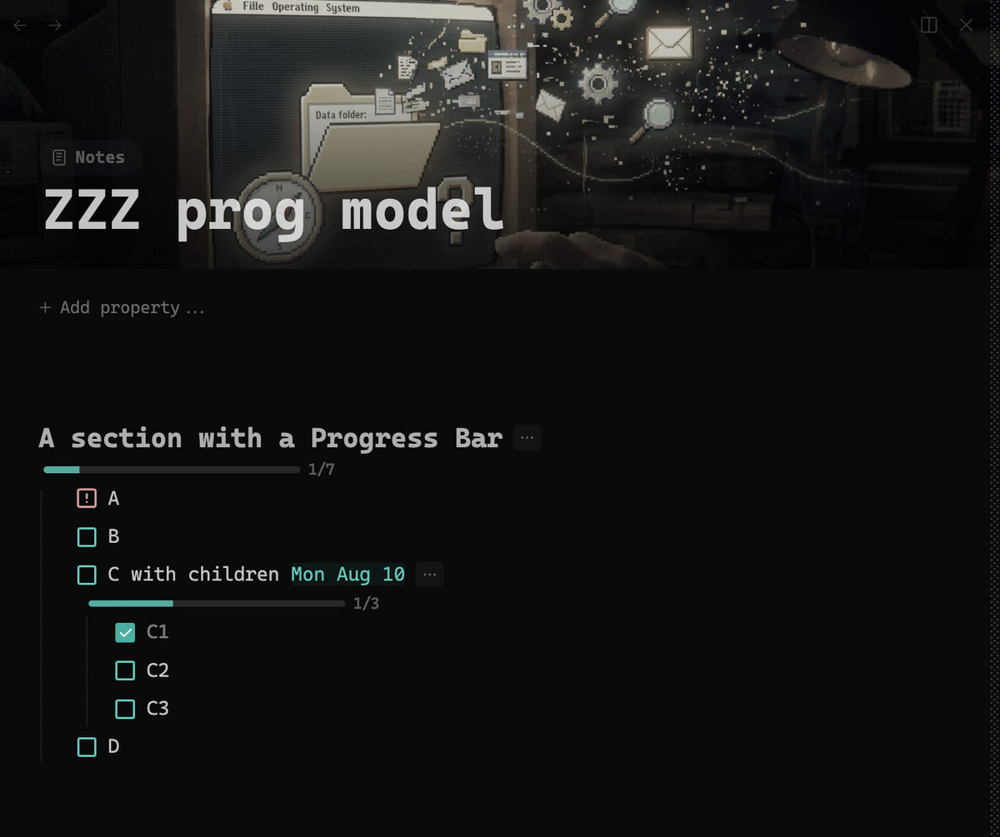
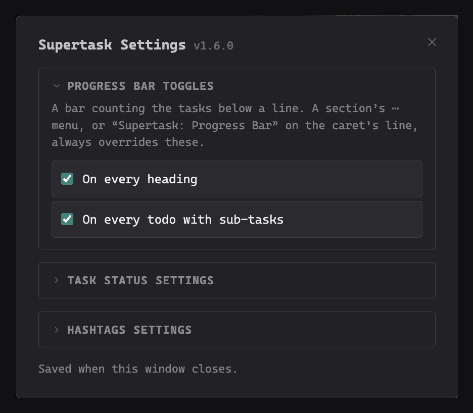

# Supertask

Supercharged tasks for [Thymer](https://thymer.com): date management and repeating tasks, self-organizing sections where you can Order by Status or Group by Status or Hashtags, checkboxes on pages, and more. All without leaving the keyboard.


## Recurring Dates

Thymer has no recurrence of its own. Supertask adds it for both halves of a GTD system: todo lines and whole pages, set from one box, with the rule stored invisibly on the item so nothing you typed is touched.

### The date box

`⌘⇧S` opens a month calendar with a text field above it. It opens with the current date preselected, so **Enter alone schedules it**. Arrow keys walk the calendar; the field uses Thymer's own date parser, so everything you can type into a line works here (`tomorrow`, `next monday`, `aug 13`, `week 10`, `Q1 2024`, `monday to friday`) and the calendar follows along so you can see where `next friday` actually lands. `+ End date` arms a range, *Set time* adds a time, *Clear* removes the date.

**Ranges have their own mode.** With an end armed, the days before the start grey out, hovering previews the span, and the calendar draws one continuous band instead of two loose endpoints. An end on the same day is read as a duration, so moving the start takes the end with it and a two-hour block stays two hours.

**Setting a date can be undone.** The toast that confirms it carries an Undo: on a page it puts the property's previous value back, on a line it restores the segments it replaced. It stands down on one case only, a forward trail, which lays out copies that cannot be half-restored.

On a touch device, or in a narrow window, the box lays itself out for fingers instead of for a mouse. Other plugins can open it too: Supertask publishes its picker, so a plugin that renders its own rows opens the real box on them rather than building a second one that drifts.

The **Repeat** row at the bottom is where recurrence starts.

### Repeating tasks

The date box's **Repeat** row does Never, Every Day / Week / Month / Year, or **Custom**: any interval, weekday sets, month-day sets, ordinals ("the last Friday"), yearly months, and an end date.


Tick a repeating task and it un-ticks itself and moves to the next occurrence. Two ways to count, chosen in Custom:

- **From the due date** — Apple Calendar's behaviour: occurrences fall where the rule says, ticking late never shifts the rhythm, and missed ones are skipped rather than piling up.
- **After completion** — "every 3 days" means three days after you actually did it. For watering the plants, not paying the rent.


The rule rides on the line as an invisible property, so an existing todo can be made repeating without retyping it, and the visible text stays yours. Repeating lines carry a small repeat glyph in front of their date chip, and date ranges move as a block, so "Mon–Fri every week" stays five days long.

**End Repeat** bounds the series: never, after *n* times, or on a date you pick from a small calendar.

### Repeating pages

Pages repeat too. Open the date box on a page — from a collection view, a page reference or a live search — and the Custom panel gains the wiring a page needs, because every collection names its fields differently:

- **Date Field** — which date the rule drives (`Due Date`, `Deadline`, whatever yours is called)
- **Done When … Is Set To** — the status field and the value that means finished
- **Then Reset To** — what that status becomes after the page moves on, or cleared

When that value lands on the page, the date advances and the status resets. Your last choices are remembered per collection, so the second page in a collection opens pre-filled.


### Leave a trail

A repeating task normally moves forward and leaves nothing behind. Two other shapes, chosen in Custom:

- **Keep Done Copies** — tick it and the finished task stays put with its date, backlinks and history intact, while a fresh copy carries the repeat to the next occurrence. Your log writes itself.


- **All Occurrences** — the whole series is laid out up front as real tasks or real pages, so twelve months of rent are visible (and summable) today. Needs an End Repeat, and is capped at 100. The series stays reconciled: shorten the end date and the surplus copies go, extend it and the missing ones appear. Completed copies are history and are never touched. Editing the rule from *any* copy edits the whole series, so you never have to hunt for the original.


The same on pages — a year of a repeating expense, laid out and summed up front:


#### Name Copies

Identical copies are hard to tell apart, so laid-out occurrences can name themselves from a template. `{title}` starts pre-picked; click a token to add it, click it again to remove it.

| Token | Renders |
|---|---|
| `{title}` | the original's name |
| `{n}` | occurrence number (the original is #1) |
| `{month}` / `{mon}` | `August` / `Aug` |
| `{date}` / `{day}` | `14 Aug` / `14` |
| `{week}` / `{year}` | ISO week / `2026` |

Everything else in the template is literal text, so the separator is yours: `{title} – {month}` gives *Rent – September*, *Rent – October*; `{title} v.{n}` gives *Rent v.2*, *Rent v.3*. The original always keeps its own name — that is how you spot it — and renaming it later never ripples into the series.

## Shortcuts

| Mac | Windows / Linux | What it does |
|---|---|---|
| `⌘⇧S` | `Ctrl+Shift+S` | Open the date box: calendar, free-text parsing, time toggle, end dates, Repeat rule |
| `⌃+` / `⌃−` | `Alt++` / `Alt+-` | Move the date one day forward / back |
| `⌘1` … `⌘0` | `Ctrl+1` … `Ctrl+0` | Tag the caret's line with your own hashtags (timeblocks, priorities, contexts, yours to define in Settings). On a page it writes that collection's *Timeblock* property instead. Same key again clears. |
| `⌃1` … `⌃0` | `Alt+1` … `Alt+0` | Set the task status: In Progress, Important, Alert, Starred, Billable, Discuss, Blocked, Clear, Done. On a page it writes the value you mapped to that status. Same chord again clears. |

Ten slots, and a slot may be left empty. The chord is the position, so slot ten answers to `⌘0` and `⌃0` whether or not the nine before it are filled.

Keys are matched by physical position, so any keyboard layout works, and the Settings panel shows the chords for your platform. Thymer binds no digit key on any modifier, so the blocks are free in-app. Two OS-level caveats: macOS can claim `⌃`-digits for *Switch to Desktop* when you use multiple Spaces (System Settings → Keyboard → Shortcuts → Mission Control), and some Linux desktops bind `Alt`-digits to window or workspace switching — free the chord in your desktop's keyboard settings if one does nothing.

## Sub-tasks keep their context

A todo that lives under another todo reads fine on its own page, because the indentation tells you. Met in a **live search result** or in Thymer's **Tasks view** it arrives with no context at all, and nothing says it is one step of something bigger.

Those rows get a small glyph in front of the title. Nothing to switch on, and the page itself is left alone, since the indentation already carries it there. Like the progress bars, it works on pages you have never opened.

## Which date moves

One set of chords covers both halves of a GTD system. The target resolves in this order:

1. A focused row in a collection view → that page's **Due Date** property
2. A **page** returned by a live search → that page's **Due Date** property
3. The caret's line carries a date → that date
4. The caret's line **is** a page reference (one ref and nothing else) → the referenced page's **Due Date**
5. Anything else → a new date on the line, counted from today

Rule 4 is deliberately strict: a prose todo that merely mentions `[[Some Project]]` moves its *own* date, never the project's. Everything works inside live searches too — the plugin follows Thymer's virtual result rows to the real lines behind them. `Due Date` is found by name, so any collection with such a field works regardless of its internal field id.

## Page checkboxes

Half of a GTD system is not lines. A project, a client, an article is a page, and its status already lives in a property on it. Referenced from a line, or listed by a live query, such a page arrives as a bare title: you cannot see where it stands, and you cannot move it on without opening it.

Point Supertask at that property and those rows get a real checkbox, wherever the page is rendered: as a reference on a line, as a row in a live query, inside a transclusion.

Map the property's values onto the statuses you use, and the row draws exactly as a todo of that status would, on any theme, because it borrows Thymer's own tokens for it: **Done, Not Done, In Progress, Important, Alert, Starred, Billable, Discuss, Blocked, Cancelled**. An Alert page pulses like an Alert todo does. A value you have not mapped, and an empty property, draw no box at all, which is what keeps the decoration honest: a page with no status set does not pretend to have one.

Clicking the box writes the property, so it syncs and collaborates like a hand-made edit. The `⌃`-digit chords reach those rows too, so any mapped status is one chord away without opening the page.

**One rule for every collection.** Wiring each collection separately gets old fast, so *On every Page* matches a single property **by name** across the whole workspace, which is all you need when every collection calls its status the same thing. Your per-collection wiring is kept while the global rule is on, and comes back untouched when you switch it off.

It is all configured under **Page Checkboxes** in Settings.

## Group and order your sections

Every heading can organize its own tasks. Open the `⋯` menu next to it, or use the command palette:


The `⋯` menu itself comes from **[View Options](https://github.com/parham-shafti/thymer-view-options)**, a separate plugin that several plugins share so that one menu serves them all instead of each growing a chip of its own next to the same line. Install it and Supertask's rows, *Order/Group Section* and *Progress Bar*, appear there. Nothing is lost without it: every choice below is also a command in the palette.

- **Group by Status** — flagged tasks collect under status roofs (Starred, Alert, Important, Billable, In Progress, Discuss, Blocked), with **Done** last, starting collapsed, done on top and canceled at the bottom. Untriaged tasks can gather under a **Todo** roof just above Done.
- **Group by Hashtags** — roofs named after your `⌘`-digit hashtags, in `⌘`-digit order. Only the hashtags you configured count. Done always wins: a finished task files under Done, never lingers in the day plan.

- **Order by Status** — no roofs (except an optional Done group): a flat list sorted by status rank, untriaged at the bottom of the actives.


The roofs are real H5 headings, so they fold natively. A roof only exists while it has tasks — empty ones disappear by themselves. Tasks arriving from anywhere — moved in from another page, captured, typed, retagged, restatused — file themselves under the right roof within a couple of seconds. Turn everything off with one click and the section returns to a flat list.

Grouping can also be enabled **globally** in Settings: pick the statuses, and every heading in the workspace groups them as tasks change, no per-section setup. A section's own `⋯` menu always overrides the global choice.


## Progress bars

A heading can show how far its list has got, as a thin bar under the title with the count beside it. Switch it on for one section from its `⋯` menu, or with **Supertask: Progress Bar** on the caret's section.



A heading counts its **direct** tasks, so a nested checklist stays its own business and does not inflate the number above it. Give that parent task its own bar (same command, caret on the task) and it starts counting its sub-tasks — and its numbers then roll up into the heading too. Canceled tasks count as resolved, so a section with nothing left to do reaches the end of the bar.

**Everywhere the line appears.** A bar belongs to the line, not to the page it happens to sit on, so it follows that line into a **live search result**, onto a **transclusion**, and into Thymer's **Tasks view**: the same count, wherever you meet it. It works on pages you have not opened, so a query full of tasks shows how far each one has got without visiting any of them.

Wherever a bar shows in a document, the line's `⋯` menu is there too, so you can switch that one off again, or reach its grouping and ordering.

**Two switches in Settings**, under *Progress Bar Toggles*: **On every heading**, and **On every todo with sub-tasks**. They are separate on purpose, because a bar on every heading is calm and a bar on every sub-checklist is a different appetite. Either way, a section's `⋯` menu or the palette command always overrides the switch for that one line.



## Settings

`Supertask: Settings` in the command palette. **Progress Bar Toggles** holds the two global bar switches. **Page Checkboxes** is where you pick the property that drives a page's box and map its values onto the statuses you use, per collection or through the one global rule. **Task Status Settings** lists the `⌃`-digit shortcuts and the global grouping choices. **Hashtags Settings** defines your `⌘`-digit hashtags: the row is the key, and each row takes a title (shown on roofs and in menus) plus the hashtag that lands on the line.

## Install

The plugin is a single file. Create a global plugin in Thymer, paste `plugin.js` as its code and `plugin.json` as its configuration — or push it with the Thymer CLI:

```bash
thymer plugin update code <plugin-guid> --file plugin.js -w <workspace-guid>
```

The `⋯` menu on a line comes from **[View Options](https://github.com/parham-shafti/thymer-view-options)**, which is its own plugin. Install that as well if you want the menu. Supertask is complete without it.

## Notes

- Statuses, dates and moves go through Thymer's own APIs, so everything syncs and collaborates like hand-made edits.
- The recurrence and hashtag engines are covered by offline test suites (`node test-recurrence.mjs`, 60 cases; `node test-timeblock.mjs`, 14 cases) that extract the shipped code verbatim, so tests and plugin cannot drift.

## License

MIT
